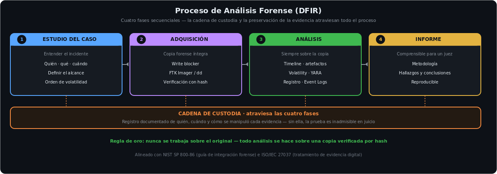
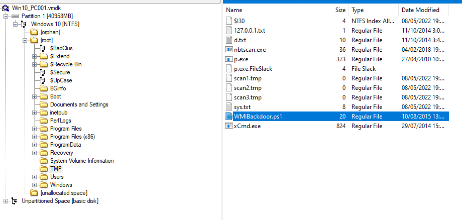
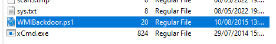
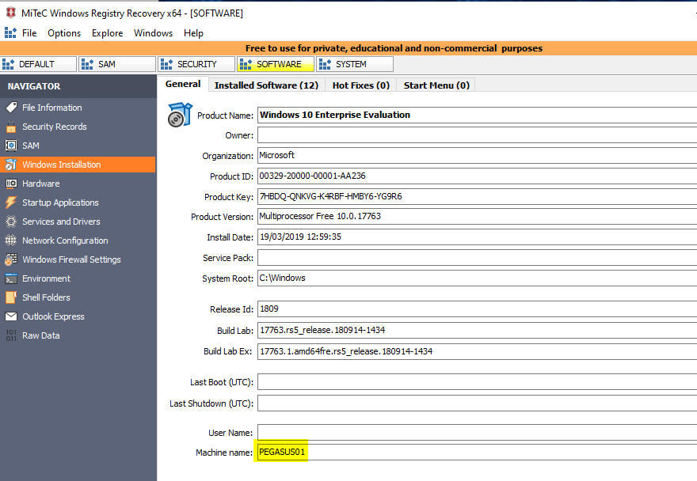
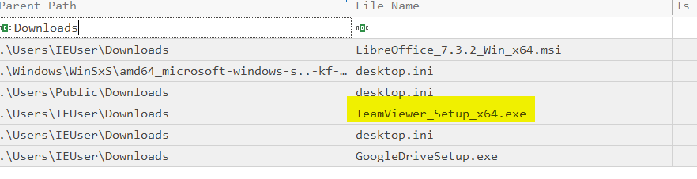
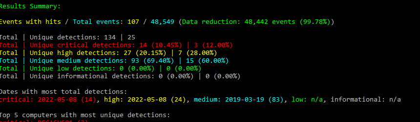
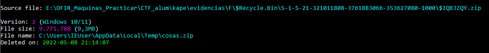
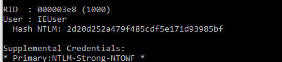
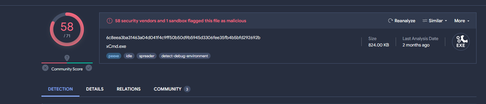

<h1 align="center">Digital Forensics · DFIR</h1>

  
  
  
  
  

---

## Sobre este proyecto

Investigación forense de extremo a extremo sobre un **equipo Windows comprometido**, combinando **análisis de disco**, **análisis de memoria RAM** y **análisis de metadatos**. El objetivo: reconstruir el incidente respondiendo *quién, qué, cuándo, cómo y desde dónde*, con el rigor metodológico y la cadena de custodia que exige una evidencia admisible.

El caso se resolvió al **100% (CTF 27/27)** y culmina en una memoria pericial con la cronología del ataque reconstruida.

> 📄 **[Ver memoria pericial completa (PDF)](Practica_Final_DFIR_Juan_Malbran.pdf)** — análisis de disco, memoria RAM y metadatos paso a paso, con capturas y la cronología del compromiso.

---

## Proceso forense

Cuatro fases atravesadas por la **cadena de custodia**: sin ella, la prueba es inadmisible. Regla de oro — nunca se trabaja sobre el original, siempre sobre una copia verificada por hash.

---

## Stack tecnológico

| Herramienta | Uso |
|---|---|
| FTK Imager · HashMyFiles | Montaje de imagen y verificación de integridad (MD5/SHA-256) |
| Registry Explorer · WRR | Análisis de hives del registro (SYSTEM, SOFTWARE, SAM) |
| MFTECmd · PECmd · RBCmd · LECmd | Artefactos NTFS: $MFT, Prefetch, Papelera, LNK |
| EvtxECmd · Hayabusa · Chainsaw | Análisis y triage de logs de eventos (.evtx) |
| Volatility 3 | Análisis de memoria RAM |
| Mimikatz | Extracción de hashes NTLM de los hives SAM/SYSTEM |
| ExifTool | Análisis de metadatos EXIF |

---

## Metodología de análisis de disco

Orden de artefactos seguido sobre la imagen NTFS:

1. **Montaje + hash** — FTK Imager en modo lectura; SHA-256 calculado antes de tocar nada (cadena de custodia).
2. **Identificación del sistema** — nombre de equipo, zona horaria, versión y usuarios (hives SYSTEM/SOFTWARE/SAM). Se reproducen los *transaction logs* si el hive está "dirty".
3. **Timeline** — `$MFT` con MFTECmd + supertimeline con log2timeline/plaso; búsqueda de ejecutables en rutas inusuales y accesos masivos (exfiltración).
4. **Ejecución de programas** — Prefetch (PECmd), Amcache y Shimcache: qué se ejecutó, cuántas veces y cuándo.
5. **Actividad de usuario** — RecentDocs, LNK (LECmd), JumpLists (JLECmd), ShellBags.
6. **Dispositivos USB** — `USBSTOR` + `setupapi.dev.log`, correlacionados con el Drive Serial de los LNK.
7. **Logs de eventos** — Event IDs clave (4624/4648 acceso remoto, 4688 procesos, 4698 tareas, 1102 log borrado).
8. **$UsnJrnl / $LogFile / Shadow Copies** — recuperación de ficheros borrados.
9. **Anti-forense** — detección de *timestomping* comparando timestamps `$SI` vs `$FN`.

---

## Caso resuelto — máquina PEGASUS01

Reconstrucción de la cadena de ataque completa a partir de la evidencia:

| Vector | Evidencia | Herramienta |
|---|---|---|
| **Acceso inicial** | Credenciales débiles (usuario administrador con contraseña `qwerty`) | Mimikatz + hash cracker |
| **Herramientas de ataque** | Kit completo en `C:\TMP` (nbtscan, xCmd, WMIBackdoor.ps1) | FTK Imager + Hayabusa |
| **Puerta trasera** | TeamViewer instalado; sesión entrante registrada en `Connections_incoming.txt` | PECmd + análisis de artefacto |
| **Movimiento lateral** | Event ID 4648 — acceso SMB (445) desde IP interna atacante | EvtxECmd |
| **Escalación** | `svchost.exe` malicioso ejecutado desde una cuenta de usuario | Volatility |
| **Exfiltración** | Canal C2 ESTABLISHED hacia servidor externo | Volatility netscan |

**Hallazgo de triage:** de 40.549 eventos, Hayabusa redujo a 107 con hallazgos relevantes (−99,78%) — el valor de un triage automatizado antes del análisis manual.

---

## Análisis de memoria RAM (Volatility 3)

Volcado analizado con el workflow completo: `windows.info` → `pslist`/`psscan` (diff para detectar procesos ocultos DKOM) → `pstree` (relaciones padre-hijo anómalas) → `cmdline` → `netscan` → `malfind` (código inyectado) → `hashdump`.

**Proceso malicioso identificado:**

| Campo | Valor | Anomalía |
|---|---|---|
| Nombre | `svchost.exe` | Ruta en `Downloads`, no en `System32` |
| PID | 6812 | Hijo de `explorer.exe` — `svchost` nunca debe serlo |
| C2 | `13.127.155.166:8888` | ESTABLISHED en el instante del volcado |

Con `netscan` se mapearon **5 canales C2** y múltiples backdoors (RDP 3389, RPC 135, puertos dinámicos 49664+), y se reconstruyó la **cronología minuto a minuto** del compromiso (spawn masivo de procesos → conexiones externas → shell interactiva).

---

## Análisis de metadatos EXIF

Comparativa de qué preserva y qué elimina cada plataforma al reenviar una misma foto:

| Plataforma | Tamaño | EXIF (GPS/dispositivo) | Compresión |
|---|---|---|---|
| Email (original) | 2.4 MB | **Completos** | Sin cambios |
| WhatsApp | 730 kB (−70%) | Eliminados | Progressive DCT |
| Discord | 606 kB (−75%) | Eliminados | Baseline DCT |
| Instagram | 107 kB (−96%) | Eliminados | Baseline DCT |
| Telegram | 64 kB (−97%) | Eliminados | Progressive DCT |

**Conclusión forense:** el email es el único canal que preserva las coordenadas GPS intactas — clave si se necesita probar dónde se tomó una foto.

---

## Errores comunes evitados

- **Analizar el original** → siempre sobre copia verificada por hash; el original se preserva.
- **Ignorar un hive "dirty"** → reproducir los transaction logs antes de leer el registro.
- **Confiar solo en los timestamps `$SI`** → compararlos con `$FN` para detectar timestomping.
- **Confundir `SAM`/`SYSTEM` con sus `.LOG`** → los transaction logs no sirven para extraer hashes.

---

## Evidencia del laboratorio

Capturas propias del análisis, tomadas durante la investigación forense.

| | |
|---|---|
|  |  |
| Montaje de la imagen en FTK Imager y recorrido del sistema de archivos | Kit de herramientas del atacante hallado en `C:\TMP` |
|  |  |
| Análisis de los hives del registro (Registry Explorer) | Artefacto de ejecución / descargas del atacante |
|  |  |
| Triage de logs de eventos con Hayabusa | Extracción de hashes NTLM de los hives SAM/SYSTEM |
|  |  |
| Crackeo del hash de la cuenta comprometida | Validación del proceso malicioso en VirusTotal |

---

## Módulos relacionados

- **[Analisis-de-Malware](https://github.com/juanmalbran/Analisis-de-Malware)** — YARA, IOCs y análisis de artefactos: disciplinas fuertemente solapadas.
- **[Blue-Team](https://github.com/juanmalbran/Blue-Team)** — el SIEM y los logs del SOC son la fuente de evidencia para una investigación DFIR.
- **[Nullsec](https://github.com/juanmalbran/Nullsec-SIEM-ELK)** — detección en tiempo real de las TTPs que aquí se investigan post-mortem.

---

  Parte del portfolio de <a href="https://github.com/juanmalbran">Juan Malbrán · M4LBYTE</a>

